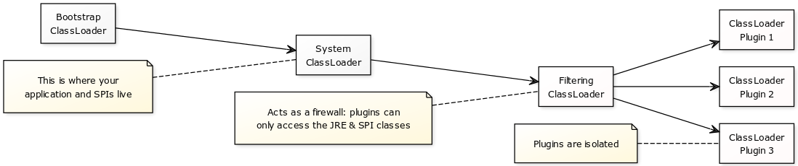

[](https://www.apache.org/licenses/LICENSE-2.0.html)
[](https://maven-badges.herokuapp.com/maven-central/net.sf.opk/plugin-loader)

Plugin Loader
=============

A simple, minimal plugin system that does not require reflection.

To use it, you'll need a separate jar (dependency) with your service interfaces and required classes
(or enums/records), providing interfaces for the Java `ServiceLoader<T>`. This jar is a compile-time
dependency for plugins, and that it is a separate jar is a requirement for classloader isolation
(see below).

Second, at runtime, you'll need one or more directories where plugins can be stored (for the plugin
structure, see below).

Once your project structure is in place, you can simply create an accessor for the plugins and use
it:

```java
// One-time setup; you can specify all your SPIs here
Plugins plugins = new Plugins(pluginFolders, FooService.class);

// Use services
Iterable<FooService> fooServicesFromAllPlugins = plugins.getServices(FooService.class);
fooServicesFromAllPlugins.iterator().next().foo();

// Direct plugin access (needed to access metadata)
Collection<Plugin> allPlugins = plugins.getPlugins();
Plugin randomPlugin = plugins.getPlugins().iterator().next();
String metadata = randomPlugin.loadTextMetadata("metadata-file.txt");
System.out.printf("Metadata for plugin %s: %s%n", randomPlugin.getName(), metadata);
```

Plugin structure
----------------

The code above loads plugins from your plugin path, which is a set of directories like this:

	plugin-dir/
	├─ single-fat-jar.jar
	├─ folder-structure/
	│  ├─ META-INF/
	│  │  ├─ MANIFEST.MF
	│  │  └─ services/
	│  │     └─ some.service.FooService
	│  ├─ directory/
	│  │  └─ my/
	│  │     └─ plugin/
	│  │        │─ Utility.class
	│  │        └─ Service.class
	│  ├─ dependency.jar
	│  └─ metadata-file.txt
	├─ ...


In this directory, we see two plugins: "single-fat-jar" and "folder-structure". The plugin names are
taken from the names in the  directory, and will only be unique if you're using a single directory
as plugin path.

The plugins themselves:

<ul><li>
have their own classloader, with a classpath consisting of JRE &amp; SPI classes and either the
plugin jar itself, or the jars and directories in the plugin directory
</li><li>
provide services using the Java {@link java.util.ServiceLoader ServiceLoader&lt;T&gt;} facility
</li><li>
can have metadata (for directory plugins, all files in the plugin directory that are not part of the
classpath)
</li></ul>

Plugin isolation
----------------

Each plugin has an isolated classpath. This is achieved with a `FilteringClassLoader`, that acts as
a firewall: it allows access to the platform classes and to specified classpath entries, but nothing
else. The classloader for each plugin adds the jars and directories packaged with the plugin
classpath.



Note that the classloaders use the default JRE delegation method: parent first. Combined with the
firewall provided by the `FilteringClassLoader`, this ensures that the same service classes are used
both by your application and the plugins. The practical result of this is that neither proxies nor
reflection are needed to use the services provided by plugins.

As a bonus, the parent-first model hides any platform and service classes included in the plugin.
So if a plugin erroneously includes the service classes as well (e.g., by marking them as
compile/implementation dependencies instead of provided/compileOnly dependencies), these are hidden.
